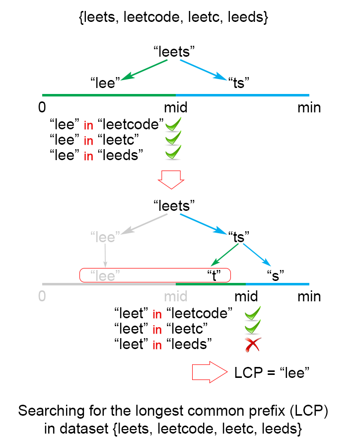

# 14. Longest Common Prefix

## 问题

Write a function to find the longest common prefix string amongst an array of strings.

If there is no common prefix, return an empty string `""`.

**Example 1:**

```
Input: ["flower","flow","flight"]
Output: "fl"
```

**Example 2:**

```
Input: ["dog","racecar","car"]
Output: ""
Explanation: There is no common prefix among the input strings.
```

**Note:**

All given inputs are in lowercase letters `a-z`.

### 解决方案

###方法一：广度优先

可以通过迭代收到的字符串数组，每次查找前`i`个字符串的最大相同前缀，其表示方式如下：

`LCP(S1...Sn) = LCP(LCP(LCP(S1, S2), S3),...Sn)`

示意图如下：

 

```java
public String longestCommonPrefix(String[] strs) {
    if (strs == null || strs.length == 0) {
        return "";
    }
    String commonPrefix = strs[0];
    for (int i = 1; i < strs.length; i++) {
        while (!commonPrefix.isEmpty()) {
            if (strs[i].indexOf(commonPrefix) != 0) {
                commonPrefix = commonPrefix.substring(0, commonPrefix.length() - 1);
            } else {
                break;
            }
        }
    }
    return commonPrefix;
}
```


##### 复杂度

- 时间复杂度：`O(s)`。`s`为`strs`所有字符的个数。最坏情况下`strs`中的所有字符串均为相等的字符串，此种情况下时间复杂度为`O(strs[0].length() * strs.length) = O(s)`。
- 空间复杂度： `O(1)`

### 方法二：深度优先

如果仅仅有一小段相同的字符为最大相同前缀，方法一种还是会进行`s`次比较。可以采用深度优先进行优化——获取首个字符串的各个字符依次与其他字符串对应位置的字符进行比较，当第n个字符时所有的字符串不再匹配或其中一个字符串长度为n时停止匹配，前n个字符为最大相同前缀。


```java
public String longestCommonPrefix(String[] strs) {
    if (strs == null || strs.length == 0) {
        return "";
    }
    for (int i = 0; i < strs[0].length(); i++) {
        Character firstChar = strs[0].charAt(i);
        for (int j = 1; j < strs.length; j++) {
            if (i == strs[j].length() || firstChar != strs[j].charAt(i)) {
                return strs[0].substring(0, i);
            }
        }
    }
    return strs[0];
}
```

##### 复杂度

- 时间复杂度：`O(s)`，`s`为字符数组中所有字符的数量。最坏情况下字符数组中有`n`个相同的字符串，`s = m * n`；最优情况下`s = m * minLen`，`minLen`为字符数组中最短字符串的长度

- 空间复杂度：`O(1)`

### 方法三：分治法

在此问题中可以将问题分解为若干相同的子问题`LCP(S1...Sn) = LCP(LCP(S1...Sk), LCP(LCP(Sk+1...Sn)))`


```java
public String longestCommonPrefix(String[] strs) {
    if (strs == null || strs.length == 0) {
        return "";
    }
    return longestCommonPrefix(strs, 0, strs.length - 1);
}

private String longestCommonPrefix(String[] strs, int left, int right) {
    if (left == right) {
        return strs[left];
    } else {
        int middle = (left + right) / 2;
        String leftCommonPrefix = longestCommonPrefix(strs, left, middle);
        String rightCommonPrefix = longestCommonPrefix(strs, middle + 1, right);
        return commonPrefix(leftCommonPrefix, rightCommonPrefix);
    }
}

private String commonPrefix(String str1, String str2) {
    int minLength = Math.min(str1.length(), str2.length());
    for (int i = 0; i < minLength; i++) {
        if (str1.charAt(i) != str2.charAt(i)) {
            return str1.substring(0, i);
        }
    }
    return str1.substring(0, minLength);
}
```


##### 复杂度分析

在以下分析中设定`n`为字符串个数,`m`为字符串的长度

- 时间复杂度：`O(mlog(n))`

  ```
  T(n) = 2⋅T(n/2)+O(m)
  T(n) = 2^xT(n/2^x) + xO(m)
  let n = 2^x, x = log(2)(n)= log(n)
  T(n) = n + log(n)O(m)
  T(n) = n + O(mlog(n))
  T(n) = O(mlog(n))
  ```

- 空间复杂度：`O(mlog(n))`

  此处产生了`log(n)`个递归调用，在进行比较时使用了`m`存储临时前缀。


### 方法四：二分法

这个方法的思路是根据二分搜索得来的，其中`minLength`是字符串数组中最短字符串的长度。每次搜索时将字符串划分为两部分，丢弃其中一部分，因为其中不包含在最大公共前缀中



```java
public String longestCommonPrefix(String[] strs) {
    if (strs == null || strs.length == 0)
        return "";
    int minLen = Integer.MAX_VALUE;
    for (String str : strs)
        minLen = Math.min(minLen, str.length());
    int low = 1;
    int high = minLen;
    while (low <= high) {
        int middle = (low + high) / 2;
        if (isCommonPrefix(strs, middle))
            low = middle + 1;
        else
            high = middle - 1;
    }
    return strs[0].substring(0, (low + high) / 2);
}

private boolean isCommonPrefix(String[] strs, int len) {
    String str1 = strs[0].substring(0, len);
    for (int i = 1; i < strs.length; i++)
        if (!strs[i].startsWith(str1))
            return false;
    return true;
}
```

##### 复杂度

最坏情况下字符串数组中包含`n`个长度为`m`的字符串

- 时间复杂度： `O(S * log(n))`，`S`为字符串数组中的字符数量

  算法中产生了`log(n)`次迭代，每次地带会进行`S = m * n`次比较，因此时间复杂度为`O(S * log(n))`。

- 空间复杂度：`O(1)`

